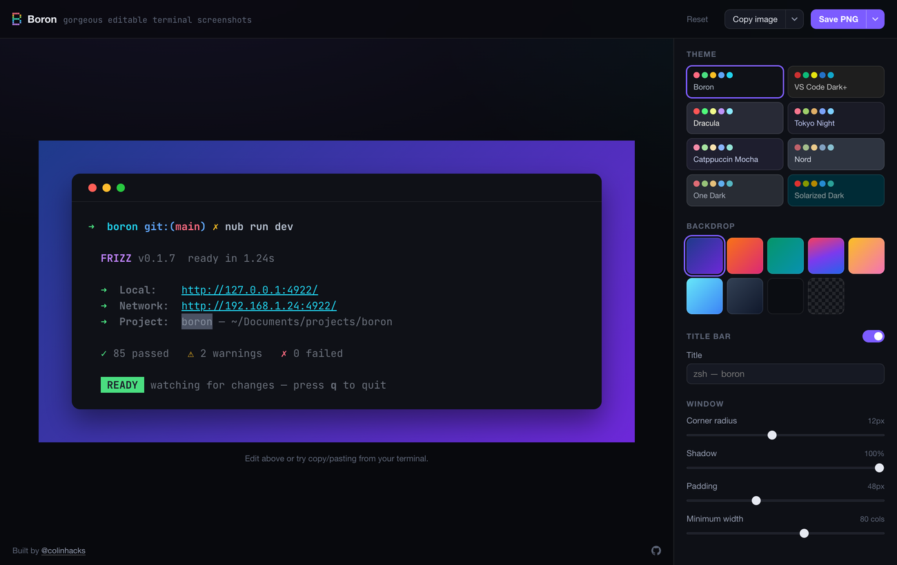
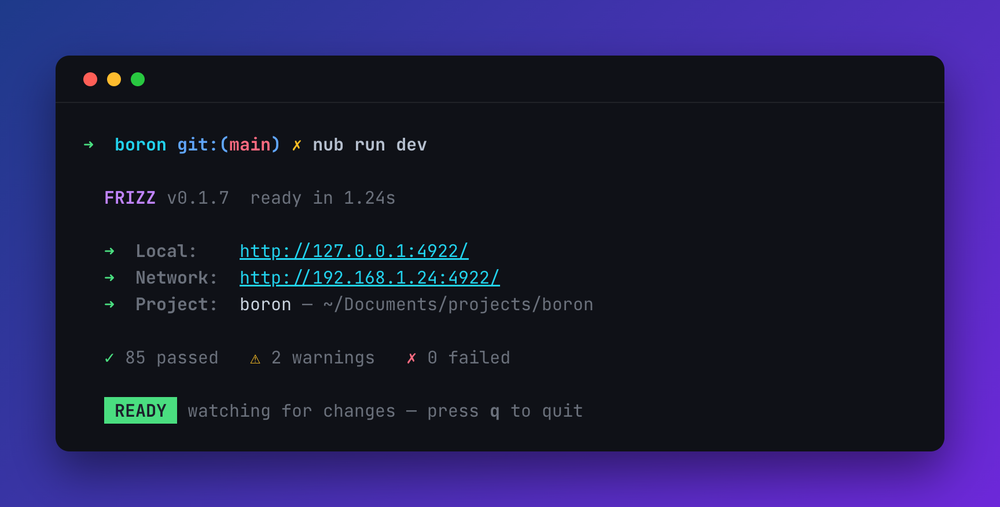

<h1 align="center">
  
   
  Boron
</h1>

Gorgeous, editable terminal screenshots.

<a href="https://boron.sh"><b>boron.sh</b></a>

  

## Features

- **Paste real output and keep its colors.** ANSI escapes are parsed in full, including 256-color and truecolor, and rich text is read from the clipboard for the terminals that write it.
- **Edit it like a document.** Select any run and recolor it, or type your own. Colors are chalk's sixteen names rather than hex, so switching theme re-maps them.
- **Select a column, not a run.** Terminal output is a grid, so the thing you want to restyle is often vertical — one column of a table, the `tree` gutter, the timestamps down the left. Alt-drag (⌥ on a Mac) draws a rectangle instead of a flowing selection, and recolors, deletes or copies exactly those cells on every row.
- **Command lines render bright, output dims.** A line opening with `$`, `❯`, a bare `>`, or oh-my-zsh's `➜` is treated as a command; everything else recedes.
- **Eight themes** — Boron, VS Code Dark+, Dracula, Tokyo Night, Catppuccin Mocha, Nord, One Dark, Solarized Dark.
- **Export PNG, SVG, JPEG or WebP**, or copy the image straight to the clipboard.
- **Copy it back out as text** — raw ANSI, a runnable chalk snippet, or plain text. Mock up what you want a program to print, then hand an agent the escape sequence.

  

Everything Boron draws is representable in a real terminal. The palette is chalk's sixteen colors, the modifiers are chalk's modifiers, and the automatic styling is expressed as chalk marks rather than hand-picked hex, so the picture you compose and the escape sequence you copy out are the same thing.

Development notes live in [AGENTS.md](AGENTS.md).

Try it 👉 [https://boron.sh](https://boron.sh)
